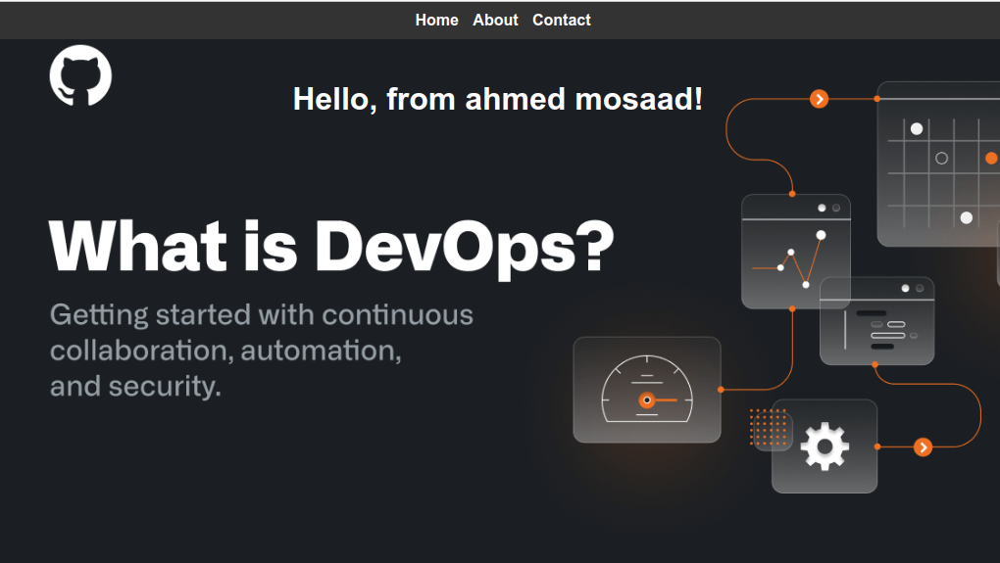

## Jenkins-Autoinstall-Terraform
This project create a pipeline on (agent-01,EC2-agent) and this pipeline create an image from docker file then create a container from this image which have nodejs app and push this image to dockerhub repo and automates the installation of Jenkins on a Docker as a container with custom docker image [docker hub image](https://hub.docker.com/layers/ahmedmosaad112/jenkins-with-docker/lts/images/sha256-7cc22cc5963a17e970a2bb2282e24316c728fd4a81798161678862397630f779?context=repo) the container use docker daemon of node01 using Ansible . It also sets up the environment and establishes SSH connection between the two or more instances using bash scripts on an EC2 instance of AWS with Ubuntu OS using Terraform as an Infrastructure-as-Code (IAC) tool.  
### Prerequisites :
1- Before running the installation, make sure you have Terraform installed. You can download it from the official website: 
```
Terraform Install
```

- Alternatively, for Ubuntu, you can run the following commands to install Terraform:
```
wget -O- https://apt.releases.hashicorp.com/gpg | sudo gpg --dearmor -o /usr/share/keyrings/hashicorp-archive-keyring.gpg
echo "deb [signed-by=/usr/share/keyrings/hashicorp-archive-keyring.gpg] https://apt.releases.hashicorp.com $(lsb_release -cs) main" | sudo tee /etc/apt/sources.list.d/hashicorp.list
sudo apt update && sudo apt install terraform
```
2- Create an AWS account: If you don't have an AWS account, go to the AWS website and create one.

3- Create an IAM user: In the AWS Management Console, go to the IAM service. Create a new IAM user Make sure to save the AWS_ACCESS_KEY_ID and AWS_SECRET_ACCESS_KEY associated with this user.

4- Download the credentials: After creating the IAM user, you can download the CSV file containing the credentials. This file includes the access key ID and secret access key. Save this file locally in a secure location.

### Installation 
- Follow these steps to install and configure Jenkins:

1- Clone this repository:
```
git clone https://github.com/your-username/jenkins-autoinstall-terraform.git
```
```
cd jenkins-autoinstall-terraform
```
2- Set the required environment variables to acess your AWS account :
```
export AWS_ACCESS_KEY_ID="YOUR_ACCESS_KEY_ID"
export AWS_SECRET_ACCESS_KEY="YOUR_SECRET_ACCESS_KEY"
export AWS_REGION="YOUR_REGION"
```
3- Generate an SSH key pair by running the following command and pressing enter for defaults:
```
ssh-keygen -t rsa -b 2048 -f admin
```
4- Initialize Terraform and apply the configuration:
```
terraform init
```
```
terraform apply
```
### SSH connection 
 - Hint:The IPs of all nodes will appear as the output of Terraform. Connect to the control node using SSH:
```
sudo ssh -i "admin" ubuntu@(IP of control node)
```
5- Switch to the ansible user 
(password is "ansible", you may change it and try again to switch if it refused till switch):
```
su - ansible
```
6- Copy the SSH key to node01:
```
ssh-copy-id node01
```
7- Copy the SSH key to jenkins-ec2-agent:
```
ssh-copy-id jenkins-ec2-agent
```
### Ansible playbook
8- Open the inventory file and add the content from [here](inventory):
```
vim inventory
```
9- Open the docker.yaml file and add the content from [here](docker-jenkins.yaml) for node01 config management:
```
vim docker.yaml
```
10- Open the ec2-agent.yaml file and add the content from [here](ec2-agent.yaml) for jenkins-ec2-agent config management:
```
vim ec2-agent.yaml
```
11- Run the Ansible playbook to for node01:
```
ansible-playbook -i inventory docker.yaml
```
12- Run the Ansible playbook to for jenkins-ec2-agent:
```
ansible-playbook -i inventory ec2-agent.yaml
```
13- In your browser, open the following URL to access Jenkins:
```
http://(public_ip of node01):8080
```
### Managing jenkins
14- Connect to the node01 instance using SSH from control node:
```
ssh node01
```
or from new terminal :
```
sudo ssh ansible@(public_ip of node01)
```
15- To view the Jenkins logs to add the key , run the following command:
```
docker logs jenkins
```
### jenkins container agent 
16- on node01 run the following command to run the agent as container :
```
docker run -d -v /var/run/docker.sock:/var/run/docker.sock --rm --name=jenkins-agent-01 --publish 2200:22 -e "JENKINS_AGENT_SSH_PUBKEY=$(cat /home/ansible/public_key_jenkins)" ahmedmosaad112/jenkins-ssh-docker
```
17- for adding credentials to make master jenkins connect to agent-01 inspect the agent on node01 :
```
docker inspect jenkins-agent-01
```
18- to get the private key of master for jenkins credentials run the following command on node01 :
```
docker exec -it jenkins-master cat /var/jenkins_home/.ssh/id_rsa
```
19- use this jenkins credentials when creating node agent-01
### jenkins EC2 agent 

20- Go to the Jenkins dashboard and click on "Manage Jenkins" in the left sidebar.

21- Click on "Manage Nodes and Clouds" to access the node configuration page.

22- Click on the "New Node" button to create a new node.

23- Provide a name for the node and select the option "Permanent Agent".

24- Enter the Remote directory:

    ```
    /home/ubuntu/jenkins_home
    ```
25- Enter the Labels: 

    ```
    ec2-agent
    ```
26- Launch method: Select "Launch agents via SSH" to connect to the EC2 instance using SSH.

27- Host: Enter the public IP of jenkins-ec2-agent

28- Credentials: Add SSH credentials to connect to the EC2 instance (copy *admin* private key you generated):

29- Availability: Specify when the node should be available for builds.

30- Click on the "Save" button to create the node.

### jenkins Pipeline
31- once you open jenkins Add Github and Dockerhub credentials in Jenkins go to :
> Manage Jenkins > Manage Credentials > Global > Add Credentials

Make sure to use Dockerhub access token instaed of the password Dockerhub 
> Account Settings > Security > New Access Token

32- Create Jenkins Pipeline
Choose pipeline, if not found you can install it from Manage Jenkins > Manage Plugins

In Pipeline Section in the end of the page choose Pipeline script from SCM
> Add Gihub Repository link [Github link](https://github.com/AHMEDMOSSAD29/jenkins-autoinstall-terraform.git) (you can fork it and use it)> Using Github Credentials

Make usre you choose the right branch which is (main) here and the right path of the which is (Jenkinsfile) here

33- access your dockerhub to find the new image and you can find the image on node01:
```
docker images
```
34- acess the application:
```
http://(public_ip of node01):3000
```


- Note: You can modify the Ansible task (which is Jenkins in this repository) and the number of nodes to suit your specific task.

- Feel free to make any necessary changes and contribute to this project!

- That's it! You have successfully run the pipeline,installed and configured Jenkins using Ansible and Terraform.
